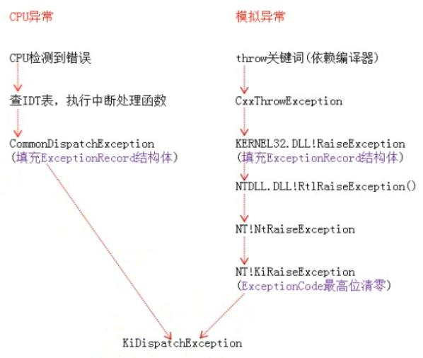
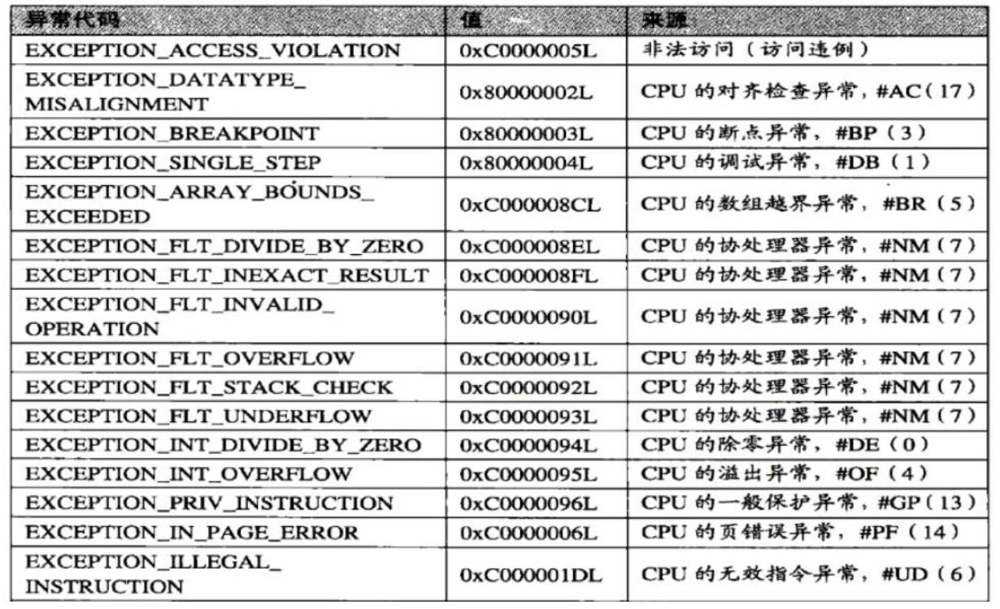
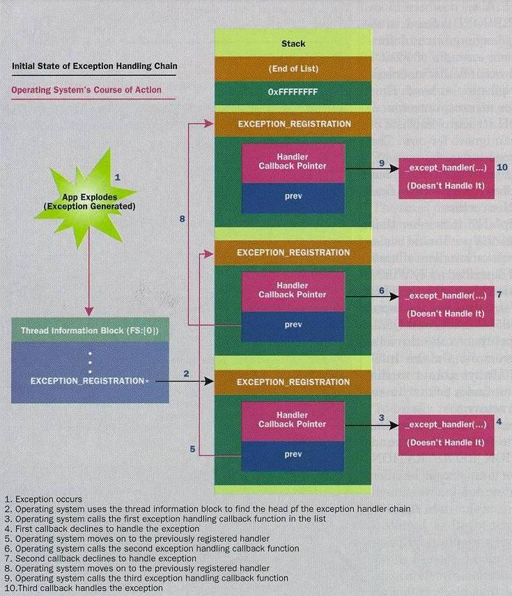
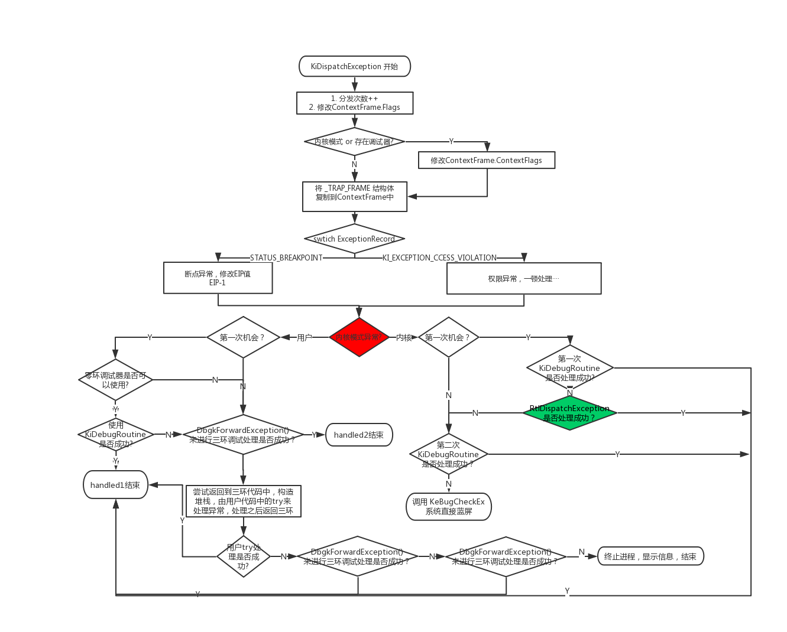

<!-- TOC -->

- [1. 概述](#1-概述)
    - [1.1. 异常与调试的关联](#11-异常与调试的关联)
    - [1.2. 参考资料](#12-参考资料)
    - [1.3. 异常处理机制](#13-异常处理机制)
    - [1.4. 异常的类别](#14-异常的类别)
    - [1.5. 异常的处理流程](#15-异常的处理流程)
- [2. 记录异常信息](#2-记录异常信息)
    - [2.1. 异常类型代码](#21-异常类型代码)
    - [2.2. 模拟异常的特殊填充](#22-模拟异常的特殊填充)
- [3. 异常分发：KiDispatchException](#3-异常分发kidispatchexception)
    - [3.1. 异常回调函数在哪里](#31-异常回调函数在哪里)
    - [3.2. KiDispatchException](#32-kidispatchexception)
    - [3.3. 用户态分发：KiUserExceptionDispatcher](#33-用户态分发kiuserexceptiondispatcher)
    - [3.4. VEH](#34-veh)
    - [3.5. 展开（UNWIND）](#35-展开unwind)
        - [3.5.1. 局部展开](#351-局部展开)
        - [3.5.2. 全局展开](#352-全局展开)
- [4. 异常处理](#4-异常处理)
    - [4.1. 函数格式](#41-函数格式)
    - [4.2. 函数返回值](#42-函数返回值)
- [5. 编译器层面的异常处理机制](#5-编译器层面的异常处理机制)
    - [5.1. 代码形式](#51-代码形式)
    - [5.2. 过滤器表达式](#52-过滤器表达式)
    - [5.3. VC++的拓展：VC_EXCEPTION_REGISTRATION](#53-vc的拓展vc_exception_registration)
        - [5.3.1. __except_handler3](#531-__except_handler3)
- [6. 未处理异常](#6-未处理异常)
    - [6.1. 第一道防线：VC++](#61-第一道防线vc)
    - [6.2. 第二道防线：kernel32.dll](#62-第二道防线kernel32dll)
        - [6.2.1. 过滤器表达式：UnhandledExceptionFilter函数](#621-过滤器表达式unhandledexceptionfilter函数)

<!-- /TOC -->
# 1. 概述
## 1.1. 异常与调试的关联
异常与调试是紧密相连的，异常是调试的基础。软件调试、反调试、调试器都与异常息息相关。
## 1.2. 参考资料
微软工程师Matt Pietrek所发表的《A Crash Course on the Depths of Win32™ Structured Exception Handling》。
## 1.3. 异常处理机制
当一个线程出现错误时，操作系统调用用户定义的一个回调函数，用以修复错误或者进行其它任何事情，并返回一个值来告诉操作系统下一步做什么。
## 1.4. 异常的类别
* 按照产生源分类
    * CPU异常：由CPU产生、发现的异常
    * 模拟异常：由软件模拟产生，如throw、raise语句
* 按照产生位置分类
    * 内核异常：在内核产生的异常
    * 用户异常：在用户空间产生的异常
## 1.5. 异常的处理流程
* 记录异常信息（异常类型、异常发生的位置等）
* 进行异常分发：寻找异常的处理函数
* 异常处理：调用异常处理函数
# 2. 记录异常信息


throw关键词和CxxThrowException为C语言的模拟异常特征，其它编程语言提供的模拟异常机制的这两点（关键词和初始调用函数）是不同的。
## 2.1. 异常类型代码

## 2.2. 模拟异常的特殊填充
模拟异常在填充ExceptionRecord结构体的时候，ExceptionCode为一个固定值，该值依赖于编译环境；ExceptionAddress也是固定值，为RaiseException函数的地址。
# 3. 异常分发：KiDispatchException
## 3.1. 异常回调函数在哪里
SEH是线程相关的，也就是说每个线程有它自己的异常处理回调函数。通过当前线程的FS:[0]可以找到TEB，进而找到一个_EXCEPTION_REGISTRATION_RECORD结构体链表（该结构一般位于栈中，零环和三环均使用该结构体，一个结构体对应一个异常处理函数），操作系统遍历该链表，以查找一个同意处理该异常的结构体（通过返回值表达是否同意处理），只要找到一个处理异常的函数，就会停止遍历。

## 3.2. KiDispatchException
所有类型的异常均通过KiDispatchException函数分发。


* 内核RtlDispatchException会遍历存于fs:[0]的内核异常链表调用异常处理函数
* 返回三环时，EIP指向KiUserExceptionDispatcher，进行用户态的分发
## 3.3. 用户态分发：KiUserExceptionDispatcher
```c
//伪代码
KiUserExceptionDispatcher(PEXCEPTION_RECORD pExcptRec, CONTEXT * pContext)
{
    DWORD retValue;
    // 通过ntdll!RtlDispatchException寻找异常处理函数处理异常
    // 如果异常被处理，那么RtlDispatchException函数就不会返回，而是调用ZwContinue
    // ZwContinue调用NtContinue，进入0环，恢复TrapFrame然后通过KiServiceExit再次返回到3环，回到修正后的位置继续执行
    // 如果处理失败则会调用ZwRaiseException来对异常进行二次分发
    // 如果它返回了，只有两种可能：或者调用了NtContinue以便让进程继续执行，或者产生了新的异常。如果是这样，那异常就不能再继续处理了，必须终止进程
    if ( RtlDispatchException( pExceptRec, pContext ) )
        retValue = NtContinue( pContext, 0 );
    else
        retValue = NtRaiseException( pExceptRec, pContext, 0 );
    EXCEPTION_RECORD excptRec2;
    excptRec2.ExceptionCode = retValue;
    excptRec2.ExceptionFlags = EXCEPTION_NONCONTINUABLE;
    excptRec2.ExceptionRecord = pExcptRec;
    excptRec2.NumberParameters = 0;
    RtlRaiseException(&excptRec2);
}
// 该函数与内核模块中的函数同名，但是功能略有不同
// 该函数会遍历异常帧
int RtlDispatchException( PEXCEPTION_RECORD pExcptRec, CONTEXT * pContext )
{
    DWORD stackUserBase;
    DWORD stackUserTop;
    PEXCEPTION_REGISTRATION pRegistrationFrame;
    DWORD hLog;
    // 从FS:[4]和FS:[8]处获取堆栈的界限
    RtlpGetStackLimits( &stackUserBase, &stackUserTop );
    // 在有VEH机制的机器上，这里会先遍历VEH链表（全局异常函数链表，线程无关）并调用异常处理函数
    // 如果没有VEH函数或者异常未得到处理，则会继续遍历位于fs:[0]的SEH链表（位于堆栈，线程私有）并调用异常处理函数。
    // 获取链表指针
    pRegistrationFrame = RtlpGetRegistrationHead();
    // 遍历链表
    while ( -1 != pRegistrationFrame )
    {
        // 由于堆栈可能已经被破坏了，所以这个例程非常谨慎，会进行大量堆栈检查
        // 另外，结构在堆栈中要比前一个EXCEPTION_REGISTRATION结构高
        PVOID justPastRegistrationFrame = &pRegistrationFrame + 8;
        // 是否超出堆栈边界
        if ( stackUserBase > justPastRegistrationFrame )
        {
            pExcptRec->ExceptionFlags |= EH_STACK_INVALID;
            return DISPOSITION_DISMISS; // 0
        }
        if ( stackUsertop < justPastRegistrationFrame )
        {
            pExcptRec->ExceptionFlags |= EH_STACK_INVALID;
            return DISPOSITION_DISMISS; // 0
        }
        // 确保堆栈按DWORD对齐
        if ( pRegistrationFrame & 3 )
        {
            pExcptRec->ExceptionFlags |= EH_STACK_INVALID;
            return DISPOSITION_DISMISS; // 0
        }
        if ( someProcessFlag )
            hLog = RtlpLogExceptionHandler( pExcptRec, pContext, 0, pRegistrationFrame, 0x10 );
        DWORD retValue, dispatcherContext;
        // RtlpExecuteHandlerForException会调用EXCEPTION_REGISTRATION结构中指定的异常处理程序
        retValue= RtlpExecuteHandlerForException(pExcptRec, pRegistrationFrame, pContext, &dispatcherContext, pRegistrationFrame->handler);
        if ( someProcessFlag )
            RtlpLogLastExceptionDisposition( hLog, retValue );
        if ( 0 == pRegistrationFrame )
            pExcptRec->ExceptionFlags &= ~EH_NESTED_CALL; // 关闭标志
        EXCEPTION_RECORD excptRec2;
        DWORD yetAnotherValue = 0;
        // 根据RtlpExecuteHandlerForException的返回值做下一步处理
        if ( DISPOSITION_DISMISS == retValue )
        {
            if ( pExcptRec->ExceptionFlags & EH_NONCONTINUABLE )
            {
                // 又发生了错误，引发异常，将无法继续执行下去
                excptRec2.ExceptionRecord = pExcptRec;
                excptRec2.ExceptionNumber = STATUS_NONCONTINUABLE_EXCEPTION;
                excptRec2.ExceptionFlags    = EH_NONCONTINUABLE;
                excptRec2.NumberParameters = 0;
                RtlRaiseException( &excptRec2 );
            }
            else
                return DISPOSITION_CONTINUE_SEARCH;
        }
        else if ( DISPOSITION_CONTINUE_SEARCH == retValue ) {}
        else if ( DISPOSITION_NESTED_EXCEPTION == retValue )
        {
            pExcptRec->ExceptionFlags |= EH_EXIT_UNWIND;
            if ( dispatcherContext > yetAnotherValue )
                yetAnotherValue = dispatcherContext;
        }
        else // DISPOSITION_COLLIDED_UNWIND
        {
            excptRec2.ExceptionRecord = pExcptRec;
            excptRec2.ExceptionNumber = STATUS_INVALID_DISPOSITION;
            excptRec2.ExceptionFlags    = EH_NONCONTINUABLE;
            excptRec2.NumberParameters = 0;
            RtlRaiseException( &excptRec2 );
        }
        pRegistrationFrame = pRegistrationFrame->prev; // 转到前一个帧，继续遍历
    }
    return DISPOSITION_DISMISS;
}
// 处理异常（第一次）
RtlpExecuteHandlerForException{
    // 这里设置EDX的值是用于ExecuteHandler函数来安装一个额外的异常处理
    MOV EDX,XXXXXXXX
    JMP ExecuteHandler
}
// 处理展开（第二次）
RtlpExecutehandlerForUnwind{
    // 这里设置EDX的值是用于ExecuteHandler函数来安装一个额外的异常处理
    MOV EDX,XXXXXXXX
    JMP ExecuteHandler
}
// handler实际上是指向_except_handler()的指针
// 查找EXCEPTION_REGISTRATION结构的handler域的值并调用它
// 
int ExecuteHandler( PEXCEPTION_RECORD pExcptRec, PEXCEPTION_REGISTRATION pExcptReg, CONTEXT * pContext, PVOID pDispatcherContext, FARPROC handler ) 
{
    // 安装一个EXCEPTION_REGISTRATION帧，EDX指向相应的handler代码
    // 该帧是为了保护异常回调过程中引发了另外的异常
    // 根据异常发生在最初的回调阶段还是展开回调阶段，ExecuteHandler返回DISPOSITION_NESTED_EXCEPTION或者DISPOSITION_COLLIDED_UNWIND
    // 这两者均会导致程序终结
    PUSH EDX
    PUSH FS:[0]
    MOV FS:[0],ESP
    // 调用异常处理回调函数
    EAX = handler( pExcptRec, pExcptReg, pContext, pDispatcherContext );
    // 移除EXCEPTION_REGISTRATION帧
    MOV ESP,DWORD PTR FS:[00000000]
    POP DWORD PTR FS:[00000000]
    return EAX;
}
_RtlpExecuteHandlerForException使用的异常处理程序：
{
    // 如果设置了展开标志，返回DISPOSITION_CONTINUE_SEARCH
    // 否则，给pDispatcherContext赋值并返回DISPOSITION_NESTED_EXCEPTION
    return pExcptRec->ExceptionFlags & EXCEPTION_UNWIND_CONTEXT ?
        DISPOSITION_CONTINUE_SEARCH : ( *pDispatcherContext = pRegistrationFrame->scopetable, DISPOSITION_NESTED_EXCEPTION );
}
_RtlpExecuteHandlerForUnwind使用的异常处理程序：
{
    // 如果设置了展开标志，返回DISPOSITION_CONTINUE_SEARCH
    // 否则，给pDispatcherContext赋值并返回DISPOSITION_COLLIDED_UNWIND
    return pExcptRec->ExceptionFlags & EXCEPTION_UNWIND_CONTEXT ?
        DISPOSITION_CONTINUE_SEARCH : ( *pDispatcherContext = pRegistrationFrame->scopetable, DISPOSITION_COLLIDED_UNWIND );
}
```
## 3.4. VEH
从Windows XP开始，Windows的异常处理多了VEH（Vectored Exception Handler，向量化异常处理）机制。
* VEH为全局，基于进程
* 注册函数：PVOID AddVectoredExceptionHandler( ULONG FirstHandler, PVECTORED_EXCEPTION_HANDLER VectoredHandler)
* VEH结点的结构：_VECTORED_EXCEPTION_NODE
* 可以注册多个VEH，VEH结构体之间串成双向链表
* VEH处理优先级次于调试器处理，高于SEH处理；即KiUserExceptionDispatcher()首先检查是否被调试，然后检查VEH链表，最后检查SEH链表
* 注册VEH时，可以指定其在链中的位置，不一定像 SEH那样必须按照注册的顺序压入栈中，因此，VEH使用起来更加灵活
* VEH保存在堆中
* unwind 操作只对栈帧中的SEH链起作用，不会涉及VEH这种进程类的异常
处理。
## 3.5. 展开（UNWIND）
展开操作是为了避免在进行多次异常处理，甚至进行互相嵌套的异常处理时出现错误。
### 3.5.1. 局部展开
当被保护代码块由于continue、break、return等指令提前结束时，会在结束之前调用local_unwind函数进行局部展开（其实就是调用finally代码块，进行清理工作，并移除异常处理程序）。
### 3.5.2. 全局展开
发生异常时，在操作系统寻找到处理异常的函数之后，操作系统会重新从异常发生位置开始遍历异常记录结构体链表（此次遍历的ExceptionRecord.ExceptionCode被设置为2即EH_UNWINDING），并依次进行局部展开，最后再执行异常回调函数。
```c
// 伪代码
__global_unwind2(void *pRegistFrame)
{
    _RtlUnwind(pRegistFrame, &__ret_label, 0, 0);
    __ret_label:
}
void _RtlUnwind( PEXCEPTION_REGISTRATION pRegistrationFrame,
                PVOID returnAddr, // 并未使用（至少是在i386机器上）
                PEXCEPTION_RECORD pExcptRec,
                DWORD _eax_value)
{
    DWORD stackUserBase;
    DWORD stackUserTop;
    PEXCEPTION_RECORD pExcptRec;
    EXCEPTION_RECORD exceptRec;
    CONTEXT context;
    // 从FS:[4]和FS:[8]处获取堆栈的界限
    // 用于后面要进行的合法性检查，以确保所有将要被展开的异常帧都在堆栈范围内
    RtlpGetStackLimits(&stackUserBase, &stackUserTop);
    if (0 == pExcptRec) // 正常情况，填充pExcptRec
    {
        pExcptRec = &excptRec;
        pExcptRec->ExceptionFlags = 0;                
        pExcptRec->ExceptionCode = STATUS_UNWIND;     //设置ExceptionCode为STATUS_UNWIND
        pExcptRec->ExceptionRecord = 0;
        pExcptRec->ExceptionAddress = [ebp+4];    // RtlpGetReturnAddress()获取返回地址
        pExcptRec->ExceptionInformation[0] = 0;
   }
    if ( pRegistrationFrame )   // EXCEPTION_UNWINDING
        pExcptRec->ExceptionFlags |= EXCEPTION_UNWINDING;
    else                        // 这两个标志合起来被定义为EXCEPTION_UNWIND_CONTEXT
        pExcptRec->ExceptionFlags |= (EXCEPTION_UNWINDING|EXCEPTION_EXIT_UNWIND);
    //创建一个CONTEXT结构
    context.ContextFlags =( CONTEXT_i486 | CONTEXT_CONTROL | CONTEXT_INTEGER | CONTEXT_SEGMENTS);
    RtlpCaptureContext(&context);
    context.Esp += 0x10;
    context.Eax = _eax_value;
    PEXCEPTION_REGISTRATION pExcptRegHead;
    pExcptRegHead = RtlpGetRegistrationHead(); // 返回FS:[0]的值
    // 开始遍历EXCEPTION_REGISTRATION结构链表
    while (-1 != pExcptRegHead)
    {
        EXCEPTION_RECORD excptRec2;
        if (pExcptRegHead == pRegistrationFrame) // 遍历到参数一指定的异常帧之后，就停止展开
        {
            NtContinue(&context, 0);
        }
        else
        {
            // 如果存在某个异常帧在堆栈上的位置比异常链表的头部还低
            // 说明一定出现了错误
            if ( pRegistrationFrame && (pRegistrationFrame <= pExcptRegHead) )
            {
                // 生成一个异常
                excptRec2.ExceptionRecord = pExcptRec;
                excptRec2.NumberParameters = 0;
                excptRec2.ExceptionCode = STATUS_INVALID_UNWIND_TARGET;
                excptRec2.ExceptionFlags = EXCEPTION_NONCONTINUABLE;   // EXCEPTION_NONCONTINUABLE，该异常会导致进程直接终止
                RtlRaiseException( &exceptRec2 );
            }
        }
        PVOID pStack = pExcptRegHead + 8; // 8 = sizeof(EXCEPTION_REGISTRATION)
        // 确保pExcptRegHead在堆栈范围内，并且是4的倍数
        if ( (stackUserBase <= pExcptRegHead ) && (stackUserTop >= pStack ) && (0 == (pExcptRegHead & 3)) )
        {
            DWORD pNewRegistHead;
            DWORD retValue;
            // 这个函数会带EXCEPTION_UNWINDING标志调用异常处理回调函数
            retValue = RtlpExecutehandlerForUnwind(pExcptRec, pExcptRegHead, &context, &pNewRegistHead, pExceptRegHead->handler );
            if ( retValue != DISPOSITION_CONTINUE_SEARCH )
            {
                if ( retValue != DISPOSITION_COLLIDED_UNWIND )
                {
                    excptRec2.ExceptionRecord = pExcptRec;
                    excptRec2.NumberParameters = 0;
                    excptRec2.ExceptionCode = STATUS_INVALID_DISPOSITION;
                    excptRec2.ExceptionFlags = EXCEPTION_NONCONTINUABLE;
                    RtlRaiseException( &excptRec2 );
                }
                else
                    pExcptRegHead = pNewRegistHead;
            }
            PEXCEPTION_REGISTRATION pCurrExcptReg = pExcptRegHead;
            pExcptRegHead = pExcptRegHead->prev;
            // 移除相应的异常帧
            RtlpUnlinkHandler( pCurrExcptReg );
        }
        else // 堆栈已经被破坏！生成一个异常
        {
            excptRec2.ExceptionRecord = pExcptRec;
            excptRec2.NumberParameters = 0;
            excptRec2.ExceptionCode = STATUS_BAD_STACK;
            excptRec2.ExceptionFlags = EXCEPTION_NONCONTINUABLE;
            RtlRaiseException( &excptRec2 );
        }
    }
    // 如果执行到这里，说明已经到了EXCEPTION_REGISTRATION
    // 结构链表的末尾，正常情况下不应该发生这种情况。
    //（因为正常情况下异常应该被处理，这样就不会到链表末尾）
    if ( -1 == pRegistrationFrame )
        NtContinue( &context, 0 );
    else
        NtRaiseException( pExcptRec, &context, 0 );
}
// RtlUnwind函数的伪代码到这里就结束了，以下是它调用的几个函数的伪代码
PEXCEPTION_REGISTRATION RtlpGetRegistrationHead(void){ return FS:[0];}
// 卸载异常帧
RtlpUnlinkHandler( PEXCEPTION_REGISTRATION pRegistrationFrame ){ FS:[0] = pRegistrationFrame->prev;}
void RtlpCaptureContext(CONTEXT *pContext)
{
   pContext->Eax = 0;
   pContext->Ecx = 0;
   pContext->Edx = 0;
   pContext->Ebx = 0;
   pContext->Esi = 0;
   pContext->Edi = 0;
   pContext->SegCs = CS;
   pContext->SegDs = DS;
   pContext->SegEs = ES;
   pContext->SegFs = FS;
   pContext->SegGs = GS;
   pContext->SegSs = SS;
   pContext->EFlags = flags;                          // 它对应的汇编代码为__asm{ PUSHFD / pop [xxxxxxxx] }
   pContext->Eip = 此函数的调用者的调用者的返回地址     // 读者看一下这个函数的
   pContext->Ebp = 此函数的调用者的调用者的EBP          // 汇编代码就会清楚这一点
   pContext->Esp = pContext->Ebp + 8;
}
```
# 4. 异常处理
## 4.1. 函数格式
```c
EXCEPTION_DISPOSITION __cdecl _except_handler( 
    struct _EXCEPTION_RECORD *ExceptionRecord,    //异常处理结构体，其中包含异常类型代码和异常发生地址等信息
    void * EstablisherFrame,                      //异常信息
    struct _CONTEXT *ContextRecord,               //异常发生时的上下文
    void * DispatcherContext
);
```
## 4.2. 函数返回值
* 成功处理异常，返回EXCEPTION_CONTINUE_EXECUTION（-1），引起错误的那条指令应该被重新执行
* 未能成功处理异常，返回EXCEPTION_CONTINUE_SEARCH（0）
* 展开过程相关，ExceptionNestedException
* 展开过程相关，ExceptionCollidedUnwind
* ...
# 5. 编译器层面的异常处理机制
## 5.1. 代码形式
```c
//挂入异常处理
__try{         
    //被保护的代码
    //
}        
__except(过滤器表达式){
    //异常处理函数代码
    //
}   
//try只能和except和finally中的任意一个进行搭配
__try{}
__finally{}    //清理工作，对应展开（UNWIND），其中的代码一定会得到执行，除非finally之前直接exit退出程序
```
在一个函数中，一个__try块中的所有代码就通过创建在这个函数的堆栈帧上的一个EXCEPTION_REGISTRATION结构来保护。在函数的入口处，这个新的EXCEPTION_REGISTRATION结构被放在异常处理程序链表的头部。在__try块结束后，相应的 EXCEPTION_REGISTRATION结构从这个链表的头部被移除。形如`MOV DWORD PTR FS:[00000000],ESP`和`MOV DWORD PTR FS:[00000000],ECX`的代码就标志着正在进入或者退出一个__try块。
## 5.2. 过滤器表达式
except括号内可以是函数、表达式、立即数等等，该表达式并非被操作系统直接调用（被__except_handler3函数调用），它的值提供了异常过滤功能，必须是以下三个值：
* EXCEPTION_EXECUTE_HANDLER（1）执行代码
* EXCEPTION_CONTINUE_SEARCH（0）寻找下一个异常处理函数
* EXCEPTION_CONTINUE_EXECUTION（-1）返回出错位置继续执行
## 5.3. VC++的拓展：VC_EXCEPTION_REGISTRATION
VC6拓展了结构体_EXCEPTION_REGISTRATION_RECORD为VC_EXCEPTION_REGISTRATION，以实现在一个函数内，无论嵌套或者重复使用try{}多少次，都只注册一个异常处理函数（__except_handler3），挂入一个异常处理结构体（递归函数除外，每次递归都会注册新的异常处理函数，挂入新的异常处理结构体）。紧跟着扩展的EXCEPTION_REGISTRATION结构下面，Visual C++压入了另外两个值。一个是指向EXCEPTION_POINTERS结构（一个标准的Win32 结构）的指针。这个指针就是调用GetExceptionInformation这个API时返回的指针。GetExceptionInformation其实是一个编译器内联函数，其对应汇编代码为`MOV EAX,DWORD PTR [EBP-14]`。GetExceptionCode函数也类似，他对应汇编代码为`MOV EAX,DWORD PTR [EBP-14]`、`MOV EAX,DWORD PTR [EAX]`和`MOV EAX,DWORD PTR [EAX]`。一个是ESP的值，压入指令为`MOV DWORD PTR [EBP-18H],ESP`。最后栈帧结构如下：
```
EBP-18 栈帧中的标准ESP
EBP-14 EXCEPTION_POINTERS指针，GetExceptionInformation
EBP-10 指向前一个EXCEPTION_REGISTRATION结构
EBP-0C handler函数地址
EBP-08 scopetable数组指针
EBP-04 trylevel
EBP-00 _ebp
```
### 5.3.1. __except_handler3
发生异常之后，该函数会接管代码。然后根据_index选择scopetable中对应的scopetable_entry，并调用lpfnFilter、lpfnHandler函数。如果异常未得到处理，需要寻找下一个异常处理函数，则根据prev_entryindex向上查找并调用，直到prev_entryindex值为-1即无上层。
```c
//伪代码
int __except_handler3(
struct _EXCEPTION_RECORD * pExceptionRecord,
struct EXCEPTION_REGISTRATION * pRegistrationFrame,
struct _CONTEXT *pContextRecord,
void * pDispatcherContext)
{
    LONG filterFuncRet;               //保存过滤器表达式的返回值
    LONG trylevel;                    //保存TryLevel值
    EXCEPTION_POINTERS exceptPtrs;    //栈上的EXCEPTION_POINTERS结构
    PSCOPETABLE scopeTable;           //保存指向scopetable数组的指针
    CLD   // 将方向标志复位（不测试任何条件！）
    // 如果没有设置EXCEPTION_UNWINDING标志或EXCEPTION_EXIT_UNWIND标志，表明并非处于异常展开阶段
    if ( ! (pExceptionRecord->ExceptionFlags & (EXCEPTION_UNWINDING | EXCEPTION_EXIT_UNWIND)) )
    {
        // 设置堆栈上的EXCEPTION_POINTERS结构，初始化了GetExceptionInformation、GetExceptionCode这两个函数使用的指针
        exceptPtrs.ExceptionRecord = pExceptionRecord;
        exceptPtrs.ContextRecord = pContextRecord;
        // 把前面定义的EXCEPTION_POINTERS结构的地址放在比establisher栈帧低4个字节的位置上
        // 参考编译器为GetExceptionInformation生成的汇编代码*(PDWORD)((PBYTE)pRegistrationFrame - 4) = &exceptPtrs;
        // 获取初始的trylevel值和指向scopetable数组的指针
        trylevel = pRegistrationFrame->trylevel;
        scopeTable = pRegistrationFrame->scopetable;
        search_for_handler:
            if ( pRegistrationFrame->trylevel != TRYLEVEL_NONE )  // TRYLEVEL_NONE == -1，已经遍历结束
            {
                if ( pRegistrationFrame->scopetable[trylevel].lpfnFilter )  //如果存在过滤器表达式函数
                {
                    PUSH EBP // 保存这个栈帧指针
                    // 切换回原来的EBP，使得栈帧上的所有局部变量能够在异常发生后仍然保持它的值不变
                    EBP = &pRegistrationFrame->_ebp;
                    // 调用过滤器函数
                    filterFuncRet = scopetable[trylevel].lpfnFilter();
                    POP EBP // 恢复异常处理程序的栈帧指针
                    if ( filterFuncRet != EXCEPTION_CONTINUE_SEARCH )  // EXCEPTION_CONTINUE_SEARCH == 0，寻找下一个函数
                    {
                        // 返回出错位置继续执行
                        if ( filterFuncRet < 0 )   // EXCEPTION_CONTINUE_EXECUTION == -1
                            return ExceptionContinueExecution;
                        // filterFuncRet == EXCEPTION_EXECUTE_HANDLER == 1，执行代码
                        scopetable = pRegistrationFrame->scopetable;
                        // 让操作系统清理已经注册的栈帧即全局展开，这会使本函数被递归调用
                        __global_unwind2(pRegistrationFrame);
                        // 一旦执行到这里，除最后一个栈帧外，所有的栈帧已经被清理完毕，流程要从最后一个栈帧继续执行
                        EBP = &pRegistrationFrame->_ebp;
                        // 局部展开
                        __local_unwind2(pRegistrationFrame, trylevel);
                        // NLG = "non-local-goto" (setjmp/longjmp stuff)
                        __NLG_Notify(1);   // EAX = scopetable->lpfnHandler
                        // 把当前的trylevel设置成当找到一个异常处理程序时，SCOPETABLE中当前正在被使用的那一个元素的内容
                        pRegistrationFrame->trylevel = scopetable->previousTryLevel;
                        // 调用__except{}块，这个调用并不会返回
                        // __except{}块会先将[EBP-18H]处，之前保存的ESP值加载到ESP寄存器中，以平衡堆栈
                        pRegistrationFrame->scopetable[trylevel].lpfnHandler();
                    }
                }
                scopeTable = pRegistrationFrame->scopetable;
                trylevel = scopeTable->previousTryLevel; // 当前try不处理，进入上层try处理
                goto search_for_handler;
            }
            else // trylevel == TRYLEVEL_NONE
            {
                return ExceptionContinueSearch;
            }
    }
    else // 设置了EXCEPTION_UNWINDING标志或EXCEPTION_EXIT_UNWIND标志，处于异常展开阶段
    {
        PUSH EBP // 保存EBP
        EBP = &pRegistrationFrame->_ebp; // 为调用__local_unwind2设置EBP
        __local_unwind2(pRegistrationFrame, TRYLEVEL_NONE);  //局部展开
        POP EBP // 恢复EBP
        return ExceptionContinueSearch;
    }
}
```
# 6. 未处理异常
对于未得到处理的异常，最后还有两道防线。
## 6.1. 第一道防线：VC++
VC++库源代码中的CRT0.C文件表明VC++会对main或WinMain的调用也添加一层try{}块的封装，其过滤器表达式代码可以在WINXFLTR.C文件中找到。
## 6.2. 第二道防线：kernel32.dll
进程从kernel32.dll!BaseProcessStart开始执行，线程从kernel32.dll!BaseThreadStart开始执行，这两个函数都会在一开始添加一个SEH，来作为程序的最后一道异常防线，防止出现异常无法得到处理的情况。
```c
// 伪代码
BaseProcessStart( PVOID lpfnEntryPoint )
{
    DWORD retValue;
    DWORD currentESP;
    DWORD exceptionCode;
    currentESP = ESP;
    __try
    {
        NtSetInformationThread( GetCurrentThread(), ThreadQuerySetWin32StartAddress, &lpfnEntryPoint, sizeof(lpfnEntryPoint) );
        retValue = lpfnEntryPoint();
        ExitThread( retValue );
    }
    __except( exceptionCode = GetExceptionInformation(), UnhandledExceptionFilter( GetExceptionInformation() ) )
    {
        ESP = currentESP;
        if ( !_BaseRunningInServerProcess ) // 普通进程
            ExitProcess( exceptionCode );
        else // 服务
            ExitThread( exceptionCode );
    }
}
```
### 6.2.1. 过滤器表达式：UnhandledExceptionFilter函数
该函数通常情况下只在这里使用（非通常情况下可以被代码直接调用）。
```c
// 伪代码
UnhandledExceptionFilter(STRUCT _EXCEPTION_POINTERS *pExceptionPtrs)
{
    PEXCEPTION_RECORD pExcptRec;
    DWORD currentESP;
    DWORD retValue;
    DWORD DEBUGPORT;
    DWORD dwTemp2;
    DWORD dwUseJustInTimeDebugger;
    CHAR szDbgCmdFmt[256];     // 保存从AeDebug这个注册表键值返回的字符串
    CHAR szDbgCmdLine[256];    // 保存实际的调试器命令行参数（已填入进程ID和事件ID）
    STARTUPINFO startupinfo;
    PROCESS_INFORMATION pi;
    HARDERR_STRUCT harderr;
    BOOL fAeDebugAuto;
    TIB *pTib;                 // 线程信息块
    // 获取异常记录
    pExcptRec = pExceptionPtrs->ExceptionRecord;
    //如果是内存错误EXCEPTION_ACCESS_VIOLATION
    if ( (pExcptRec->ExceptionCode == EXCEPTION_ACCESS_VIOLATION) && (pExcptRec->ExceptionInformation[0]) )
    {
        // BasepCheckForReadOnlyResource函数会检查是否为对资源节进行写操作而导致的异常
        // 如果是，_BasepCurrentTopLevelFilter就更改出错页面正常的只读属性为允许写，并返回EXCEPTION_CONTINUE_EXECUTION
        // 系统将重新执行出错指令
        retValue = BasepCheckForReadOnlyResource(pExcptRec->ExceptionInformation[1]);
        if ( EXCEPTION_CONTINUE_EXECUTION == retValue )
            return EXCEPTION_CONTINUE_EXECUTION;
    }
    // 查看这个进程是否运行于调试器下
    retValue = NtQueryInformationProcess(GetCurrentProcess(), ProcessDebugPort, &debugPort, sizeof(debugPort), 0);
    // 如果存在调试器，通知调试器
    // 函数返回EXCEPTION_CONTINUE_SEARCH，进入第二轮分发，第二轮分发的流程同于模拟异常的分发流程，但是会被设置为第二次机会
    if ((retValue >= 0) && debugPort)
        return EXCEPTION_CONTINUE_SEARCH;
    // 检查用户是否调用过SetUnhandledExceptionFilter来安装默认异常处理程序
    // 如果调用了，那现在就调用他安装的异常处理程序
    // _BasepCurrentTopLevelFilter是KERNEL32.DLL中的一个全局变量
    if (_BasepCurrentTopLevelFilter)
    {
        retValue = _BasepCurrentTopLevelFilter(pExceptionPtrs);
        if ( EXCEPTION_EXECUTE_HANDLER == retValue )
            return EXCEPTION_EXECUTE_HANDLER;
        if ( EXCEPTION_CONTINUE_EXECUTION == retValue )
            return EXCEPTION_CONTINUE_EXECUTION;
        // 只有返回值为EXCEPTION_CONTINUE_SEARCH时才会继续执行下去
    }
    // 检查是否调用过SetErrorMode(SEM_NOGPFAULTERRORBOX)，调用过则不弹出应用程序错误框
    if ( 0 == (GetErrorMode() & SEM_NOGPFAULTERRORBOX) )
    {
        harderr.elem0 = pExcptRec->ExceptionCode;
        harderr.elem1 = pExcptRec->ExceptionAddress;
        if ( EXCEPTION_IN_PAGE_ERROR == pExcptRec->ExceptionCode )
            harderr.elem2 = pExcptRec->ExceptionInformation[2];
        else
            harderr.elem2 = pExcptRec->ExceptionInformation[0];
        dwTemp2 = 1;
        fAeDebugAuto = FALSE;
        harderr.elem3 = pExcptRec->ExceptionInformation[1];
        pTib = FS:[18h];
        DWORD someVal = pTib->pProcess->0xC;
        if ( pTib->threadID != someVal )
        {
            __try
            {
                char szDbgCmdFmt[256];
                retValue = GetProfileStringA( "AeDebug", "Debugger", 0, szDbgCmdFmt, sizeof(szDbgCmdFmt)-1 );
                if ( retValue )
                    dwTemp2 = 2;
                char szAuto[8];
                retValue = GetProfileStringA( "AeDebug", "Auto", "0", szAuto, sizeof(szAuto)-1 );
                if ( retValue )
                    if ( 0 == strcmp( szAuto, "1" ) )
                        if ( 2 == dwTemp2 )
                            fAeDebugAuto = TRUE;
            }
            __except( EXCEPTION_EXECUTE_HANDLER )
            {
                ESP = currentESP;
                dwTemp2 = 1;
                fAeDebugAuto = FALSE;
            }
        }
        // AeDebug子键下的Auto的值是否为一，是则不弹出应用程序错误对话框，准备启动即时调试器
        if ( FALSE == fAeDebugAuto )
        {
            // 弹出应用程序错误对话框
            retValue = NtRaiseHardError(STATUS_UNHANDLED_EXCEPTION | 0x10000000, 
                4, 0, &harderr,_BasepAlreadyHadHardError ? 1 : dwTemp2, &dwUseJustInTimeDebugger );
        }
        else
        {
            dwUseJustInTimeDebugger = 3;
            retValue = 0;
        }
        // 如果点击了取消按钮，系统将会附加调试器到出错进程上
        if (retValue >= 0 && (dwUseJustInTimeDebugger == 3) && (!_BasepAlreadyHadHardError)&&(!_BaseRunningInServerProcess))
        {
            _BasepAlreadyHadHardError = 1;
            SECURITY_ATTRIBUTES secAttr = { sizeof(secAttr), 0, TRUE };
            // 创建一个事件内核对象，调试器成功附加到出错进程之后会将此事件对象变成有信号状态
            HANDLE hEvent = CreateEventA( &secAttr, TRUE, 0, 0 );
            memset( &startupinfo, 0, sizeof(startupinfo) );
            // 构造启动调试器的命令行，参数有进程ID和内核对象句柄
            sprintf(szDbgCmdLine, szDbgCmdFmt, GetCurrentProcessId(), hEvent);
            startupinfo.cb = sizeof(startupinfo);
            startupinfo.lpDesktop = "Winsta0\Default"
            CsrIdentifyAlertableThread(); // ???
            // 启动调试器
            retValue = CreateProcessA(0, szDbgCmdLine, 0, 0, 1, 0, 0, 0, &statupinfo, &pi);
            if ( retValue && hEvent )
            {
                // 等待前面创建的那个事件对象。此时这个调用被阻塞，直到调试器进程将此事件变成有信号状态，以表明它已经成功附加到出错进程上
                NtWaitForSingleObject( hEvent, 1, 0);
                return EXCEPTION_CONTINUE_SEARCH;
            }
        }
        if (_BasepAlreadyHadHardError)
            NtTerminateProcess(GetCurrentProcess(), pExcptRec->ExceptionCode);
    }
    // 如果点击了确定，返回，执行HANDLER，终结程序
    // 如果是服务线程发生异常，终结线程；如果是普通线程，终结进程
    return EXCEPTION_EXECUTE_HANDLER;
}
LPTOP_LEVEL_EXCEPTION_FILTER SetUnhandledExceptionFilter( LPTOP_LEVEL_EXCEPTION_FILTER lpTopLevelExceptionFilter )
{
    LPTOP_LEVEL_EXCEPTION_FILTER previous= _BasepCurrentTopLevelFilter;
    // 设置为新值
    _BasepCurrentTopLevelFilter = lpTopLevelExceptionFilter;
    return previous; // 返回以前的值
}
```